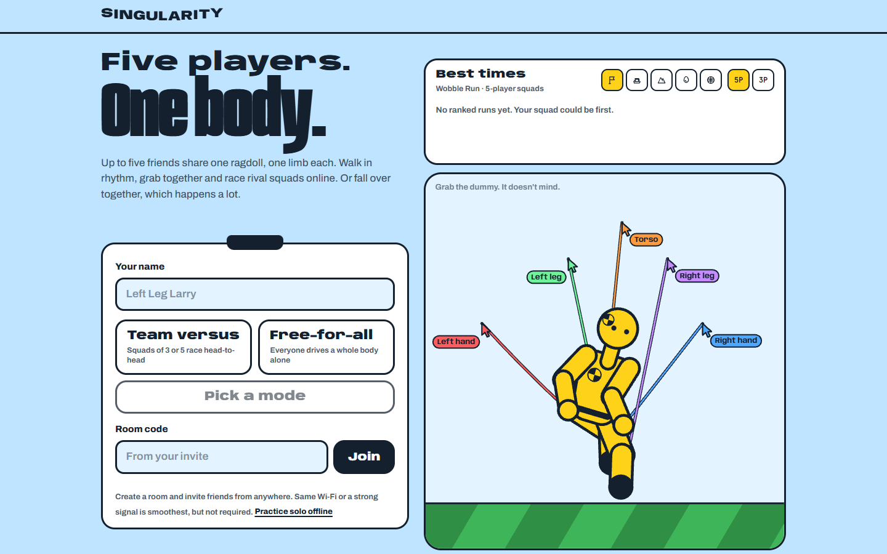

# SINGULARITY

[](https://github.com/Aryabhatta-0/singularity/actions/workflows/ci.yml)
[](LICENSE)


**Five players. One body.** A chaotic co-op physics party game that runs in your browser.



## Play online

**<https://singularity-coral.vercel.app>**

Create a room, send the invite link, and play. Friends can join from anywhere, on any network, on desktop or phone. There's nothing to install and no account. Same Wi-Fi or a strong connection gives the smoothest ride, but it isn't required.

## What is Singularity?

Someone steers with the torso, someone works the arms, and two people each own a leg. Together you walk, climb, grab, throw and try not to fall in the water, while rival squads race the same course as live ghosts.

## Features

- **Squads of 3 or 5.** Three players split arms / torso / legs; five split left hand, right hand, torso, left leg and right leg.
- **Five courses**: Wobble Run, Egg Express, Slam Dunk, Ferry Job and Summit Sync.
- **Team versus or free-for-all.** Rival squads race as ghosts, or everyone runs solo.
- **Global leaderboard.** The best full-squad and solo runs per course, filed by the server.
- **Built for real networks.** An adaptive jitter buffer, a connection indicator, and automatic reconnects that put you back in your seat.
- **Phones welcome.** On-screen joystick and buttons for your role.
- **Offline practice** in a single tab, no server needed.

| Part | Keys |
| --- | --- |
| Legs | `W` `A` `S` `D` walk / strafe, `Space` jump |
| Arms | Arrow keys raise / lower / swing, `E` grab with both hands, `Q` / `R` left / right hand, `Shift` throw |
| Torso | `C` crouch, `B` brace / get up, mouse looks around |

## How online multiplayer works

```
   players' browsers (anywhere)
   ├─ page, session token ──────▶ Vercel: Next.js app
   │                               ├ /api/session        signs short-lived game sessions
   │                               ├ /.well-known/*      public key SpacetimeDB checks them with
   │                               └ /api/leaderboard    cached, read-only top runs
   │
   └─ wss: rooms, inputs, snapshots ─▶ SpacetimeDB Maincloud: database `singularity`
                                        (only accepts sessions signed by the app)
```

- **The web app** (`src/`) is served by Vercel. Before a browser connects to the game server it asks `/api/session` for a signed session token (ES256, six hours, refreshed in the background). The signing key exists only in Vercel's server environment.
- **The game server** (`server/`) is one SpacetimeDB module, published as the database `singularity`. It rejects any connection whose token wasn't signed by the app, so it isn't an anonymous public datastore. It owns rooms, teams, seats, ready-up, the countdown → playing → results lifecycle, and relays inputs and physics snapshots. Every room is private to its members; the server only shows you rows for your own room.
- **Physics** runs in the browser. In each squad, one player's browser simulates the shared body and streams snapshots; teammates send their inputs and render the snapshots through an adaptive jitter buffer. If that player leaves or stalls, another squad member's browser takes over mid-round. Players never see this as a "host" role.
- **The server keeps time.** It schedules each round's start and times every finish itself. When a squad finishes, the server files the run to the leaderboard if it qualifies (a full squad or a solo free-for-all run, with a plausible time). Clients can't write scores.
- **Offline practice** (`?offline=1`) keeps the whole room in one tab with no server, and is offered automatically when the game server can't be reached.

## Quick start for development

You need **Node 24** and the [SpacetimeDB CLI](https://spacetimedb.com/install) **2.10**.

```bash
git clone https://github.com/Aryabhatta-0/singularity.git
cd singularity
npm install
npm run host
```

`npm run host` checks your setup, starts SpacetimeDB on this machine, publishes the game server to it, builds the game and prints where to play:

```
 SINGULARITY LOCAL DEV IS LIVE
 ──────────────────────────────────────────────────────────
 Local app    http://localhost:3001
 LAN          http://192.168.1.20:3001   ← friends on this network
 SpacetimeDB  local · port 3000 · database "singularity"
              sessions signed by http://127.0.0.1:3001 · production build
 Online game  https://singularity-coral.vercel.app   (no setup needed)
```

Open two browser windows to play with yourself; each tab is its own player. Ctrl+C stops everything.

No SpacetimeDB CLI? `npm install && npm run dev`, start a room and choose **Practice offline**.

## Self-host / local development

The local stack is the production stack in miniature: the app at `:3001` signs sessions with a key it generates under `.singularity/` (git-ignored), and the local `singularity` database trusts it.

- `npm run host -- --dev` serves with `next dev` (hot reload) instead of a production build.
- `npm run host -- --port=4000` uses another port.
- Prefer separate terminals? `spacetime start`, then `npm run db:local`, then `npm run dev`.
- Restarts keep the local leaderboard and clear old rooms.
- Friends on your network can open the LAN URL. If they can't reach it, allow ports **3001** and **3000** through your firewall. Self-hosting is meant for trusted networks; for play over the internet, use the online game.

## SpacetimeDB

| | Local | Production |
| --- | --- | --- |
| Server | `spacetime start` on `:3000` | Maincloud |
| Database | `singularity` | `singularity` |
| Trusted session issuer | `http://127.0.0.1:3001` | `https://singularity-coral.vercel.app` |
| Publish | `npm run db:local` | `npm run db:publish:maincloud` (never deletes data) |

After changing `server/`, regenerate the client bindings with `npm run bindings` and commit `src/module_bindings/`.

The database owner (whoever published it) tells it which issuer to trust, once per database:

```bash
spacetime call singularity configure_access '"https://singularity-coral.vercel.app"' --server maincloud
```

## Environment variables

Local development needs none. For a hosted deployment, see [`.env.example`](.env.example).

| Variable | Where | Purpose |
| --- | --- | --- |
| `NEXT_PUBLIC_SPACETIMEDB_URI` | public | Game server address, e.g. `wss://maincloud.spacetimedb.com`. Unset: the machine that served the page, port 3000. |
| `NEXT_PUBLIC_SPACETIMEDB_DATABASE` | public | Database name (default `singularity`). |
| `NEXT_PUBLIC_SITE_URL` | public | Canonical URL for metadata and the sitemap. |
| `SINGULARITY_SESSION_ISSUER` | server | This site's public origin; SpacetimeDB fetches its keys from here. |
| `SINGULARITY_SESSION_PRIVATE_KEY` | **secret** | ES256 private JWK that signs game sessions. Without it a Vercel deployment refuses to issue sessions. |

## Testing

| Command | What it covers |
| --- | --- |
| `npm run typecheck`, `npm run lint` | TypeScript and ESLint |
| `npm test` | Unit tests: gameplay, input, timing, jitter buffer, snapshots, sessions, access rules, leaderboard rules |
| `npm run e2e:room` | The game server end to end on a throwaway database: access control, squads, seats, round lifecycle, relays, reconnects, privacy, abuse limits |
| `npm run e2e:leaderboard` | Server-filed scores: ranking rules, dedupe, caps, and that clients can't write |
| `npm run e2e:online` | Smoke test of a deployed site and its database (never touches the leaderboard) |
| `npm run test:browser` | Playwright regression in Python, against a running `npm run host` (Chrome and `pip install -r tests/requirements-browser.txt`) |

More browser suites live in `tests/browser/`, including `network_conditions_e2e.py`, which plays a round through `scripts/net-sim-proxy.mjs` on LAN, broadband and cellular-grade links with a mid-round disconnect. The `e2e:*` suites need a local SpacetimeDB (`spacetime start`) and delete their scratch database when they finish.

## Project structure

```
server/                 SpacetimeDB module: access control, rooms, relays, round lifecycle, leaderboard
src/app/                Next.js routes: landing, /play/[code], /privacy, /terms, API and metadata routes
src/components/         GameClient (lobby, HUD, results), landing leaderboard, mobile controls
src/game/               engine: physics body, levels, input, networking, jitter buffer
src/lib/, src/server/   session signing (shared), server-only session, rate limit and leaderboard helpers
src/module_bindings/    generated client bindings — do not edit
scripts/host.mjs        npm run host
scripts/*-e2e.ts        end-to-end suites (run through scripts/run-e2e.mjs)
tests/                  unit tests (node:test), browser suites (Playwright), load test (Locust)
docs/verification.md    what was verified, and how
```

## Contributing

Contributions are welcome. Read [CONTRIBUTING.md](CONTRIBUTING.md) for setup and the checks to run, and please follow the [Code of Conduct](CODE_OF_CONDUCT.md).

## Security

Report vulnerabilities privately as described in [SECURITY.md](SECURITY.md), which also outlines the threat model and known limitations.

## Privacy

The game has no accounts and no analytics. What it does store (a display name, a random session ID, room state while you play, and leaderboard entries) is described in the in-game [Privacy policy](https://singularity-coral.vercel.app/privacy) and [Terms](https://singularity-coral.vercel.app/terms).

## License

[MIT](LICENSE) © 2026 Sankalp H S and SINGULARITY contributors.

## Credits

Made by [@sankalphs](https://github.com/sankalphs/) and [@sathvikar01](https://github.com/sathvikar01).
